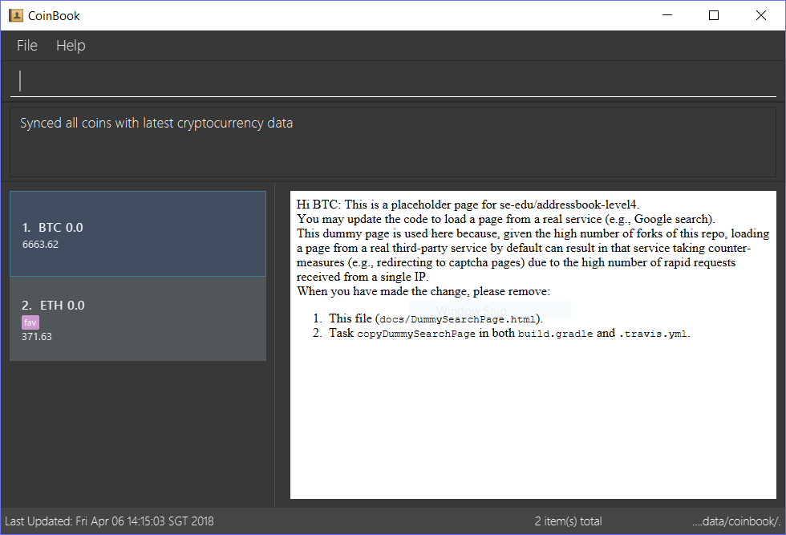

= Address Book (Level 4)
ifdef::env-github,env-browser[:relfileprefix: docs/]

https://travis-ci.org/CS2103JAN2018-F09-B3/main[image:https://travis-ci.org/CS2103JAN2018-F09-B3/main.svg?branch=master[Build Status]]
https://ci.appveyor.com/project/ewaldhew/main[image:https://ci.appveyor.com/api/projects/status/anm4ynat6657reac?svg=true[Build Status]]
https://coveralls.io/github/CS2103JAN2018-F09-B3/main?branch=master[image:https://coveralls.io/repos/github/CS2103JAN2018-F09-B3/main/badge.svg?branch=master[Coverage Status]]

ifdef::env-github[]

endif::[]

ifndef::env-github[]
image::images/Ui.png[width="600"]
endif::[]

This is a desktop Crypto Currency management portfolio called CoinBook.
It is meant for storing and keeping track of one’s cryptocurrency records such as the number of coins the user owns,
and updates the records accordingly, after the user inputs how he has traded his cryptocurrency
(i.e. has he bought more coins, bought new coins or sold current ones)

It has a GUI but most of the user interactions happen using CLI (Command Line Interface).
It is a Java application intended basically for any cryptocurrency holder but is targeted at businessmen
or investors who trade heavily and actively in cryptocurrency coins such that they own dozens of coins that
add up to a sizable value. Without the aid of a portfolio, it would be harder to track trades of so many coins especially if the trading is done quite frequently.
CoinBook also provides decision making stats to equip the user with the information necessary such that he can carry out trades, without having to check patterns and statistics on another platform other than the CoinBook itself.
The data that will be provided in the application include: current price of crypto coin (based on 24 hour average) and the profit/loss the user stands to make if he sold the coin at the current moment.
Analysis support will be provided as well with RSI and MACD support/resistance lines provided as part of analysis to provide the user with a guideline as to when it might be a good time to buy/sell his crypto. Again, this feature is added so that the user need not use an additional platform or application to find these graphs.
Price History will be displayed for the user that will allow him to see the trends of how the price of a coin has changed. To supplement this, there will also be a newsfeed that will be displayed that would enable the user to follow the news and happenings surrounding the coin and allows the user to check if there’s any correlation between the price history and the newsfeed of any given coin.

== Site Map

* <<UserGuide#, User Guide>>
* <<DeveloperGuide#, Developer Guide>>
* <<AboutUs#, About Us>>
* <<ContactUs#, Contact Us>>

== Acknowledgements

* Based off the AddressBook-Level4 project, a software project for students learning Software Engineering with Java as the main programming language. Created by the SE-EDU initiative at https://github.com/se-edu/.
* Some parts of this sample application were inspired by the excellent http://code.makery.ch/library/javafx-8-tutorial/[Java FX tutorial] by
_Marco Jakob_.
* Libraries used: https://github.com/TomasMikula/EasyBind[EasyBind], https://github.com/TestFX/TestFX[TextFX], https://bitbucket.org/controlsfx/controlsfx/[ControlsFX], https://github.com/FasterXML/jackson[Jackson], https://github.com/google/guava[Guava], https://github.com/junit-team/junit4[JUnit4]

== Licence : link:LICENSE[MIT]
